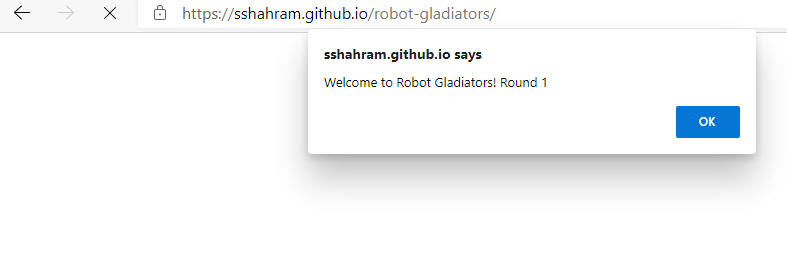
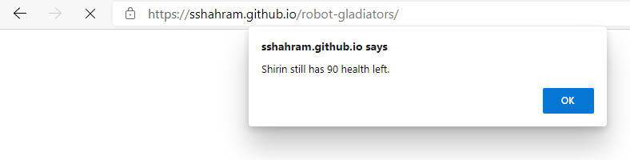
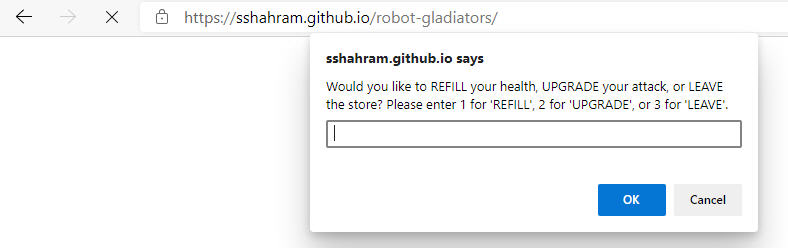
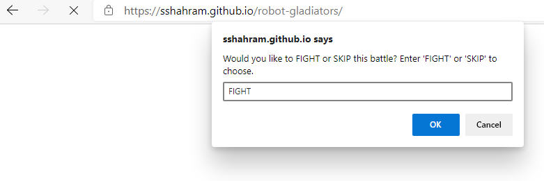

# robot-gladiators

## Description

This application is a combat simulator game called Robot Gladiators. During the game, players will coach their robot through a series of fights—gaining cash, attack power, and repairs along the way. The robot that survives with the most cash will be remembered in the browser's storage system!

## Task List

- [x] Communicate with the game player by using JavaScript functions.
- [x] Assign and manipulate data using JavaScript variables and operators.
- [x] Control the flow of the application by managing conditional statements.
- [x] Save high score using localStorage.
- [x] Add shop functionality after defeating an enemy.

## Tech/framework used

* HTML
* JavaScript

## User Story

I would like to create a fun game in which players have a series of random fights with enemies. The robot that survives with the most cash will be the winner.

## Acceptance Criteria

* The game must run in a web browser.
* The game must use minimum index.html file.
* Only the <title> element of index.html may be changed.
* We cannot use CSS.
* All game code must be contained in the game.js JavaScript file.
* The order in the fight should be randomized.
* After defeating an enemy, ask the player if they would like to purchase an item from a store.

## Link to Deployed Application

https://sshahram.github.io/robot-gladiators/

## Link to Github Repository

https://github.com/sshahram/robot-gladiators

## Screenshots

Here are some snapshots of the prompts during the game:

* Welcome Prompt

* Updating Status

* Shopping from Store

* Asking to Fight or Skip

